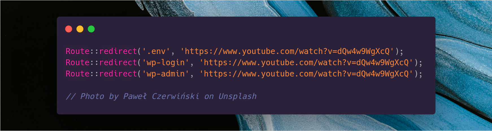

# laravel-rickroll 🎤️

[![Latest Version on Packagist][ico-version]][link-packagist]
[![Total Downloads][ico-downloads]][link-downloads]
[![Build Status][ico-travis]][link-travis]



TLDR: sometimes you just gotta rickroll people who attempt to mess with your website.

Credit to Liam Hammett for his tweet (8k+ likes) that inspired this package: https://twitter.com/LiamHammett/status/1260984553570570240/

## Installation

```bash
$ composer require mitchazj/laravel-rickroll
```

## Simple Usage

Just install the package and that's it. Out-of-the box we'll redirect:

- .env
- wp-login
- wp-login.php
- wp-admin
- wp-admin/\*
- phpinfo.php
- .htaccess

Happy Rickrolling!

## Advanced Usage

### Custom Routes

> Coming soon.

### Custom Triggers

> Coming soon.

### Custom Rickroll Video

> Coming soon.

### Callbacks

> Coming soon.

## Change log

Please see the [changelog](changelog.md) for more information on what has changed recently.

## Testing

TODO. These aren't set up properly yet.

```bash
$ composer test
```

## Contributing

Please see [contributing.md](contributing.md) for details and a todolist.

## Credits

- [Mitchell Johnson][link-author] (Orig. Author)
- [All Contributors][link-contributors]

Massive thanks to Liam Hammett for his tweet (8k+ likes) that inspired this package: https://twitter.com/LiamHammett/status/1260984553570570240/

## License

MIT. Please see the [license file](license.md) for more information.

[ico-version]: https://img.shields.io/packagist/v/mitchazj/laravel-rickroll.svg?style=flat-square
[ico-downloads]: https://img.shields.io/packagist/dt/mitchazj/laravel-rickroll.svg?style=flat-square
[ico-travis]: https://img.shields.io/travis/mitchazj/laravel-rickroll/master.svg?style=flat-square
[link-packagist]: https://packagist.org/packages/mitchazj/laravel-rickroll
[link-downloads]: https://packagist.org/packages/mitchazj/laravel-rickroll
[link-travis]: https://travis-ci.org/mitchazj/laravel-rickroll
[link-styleci]: https://styleci.io/repos/12345678
[link-author]: https://github.com/mitchazj
[link-contributors]: ../../contributors
